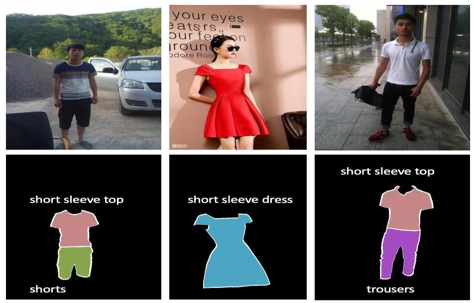
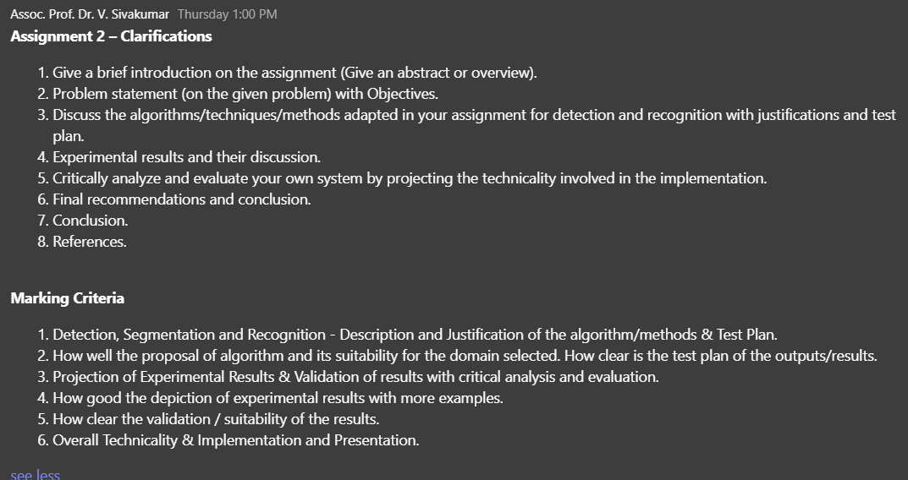

# IPCV Assignment 2 - Consolidated Requirements

This document combines the official six-page assignment brief with the lecturer's later Teams clarification. It is a working guide, not a replacement for the [original assignment PDF](<CT103-3-M-IPCV Assignment - Part 2 (APUMF2604AI).pdf>).

## 1. Assignment metadata

| Item | Requirement |
| --- | --- |
| Module | Image Processing & Computer Vision (IPCV), CT103-3-M-IPCV |
| Assessment | In-course individual assignment, Part 2 / Assignment 2 |
| Assignment title | University Professional Attire (Dress Code) Identification |
| Intake | APUMF2604AI |
| Lecturer | Assoc. Prof. Dr. V. Sivakumar |
| Weight | 60% of the total assessment grade |
| Recommended report length | Approximately 3,000-3,500 words |
| Due date | 11:59 pm, 9 August 2026 |
| Permitted development tools | Python or MATLAB |

## 2. Problem context and assignment goal

Universities need a professional environment, but manual dress-code inspection is labour-intensive and can be inconsistent, subjective, and affected by human error or bias. The assignment therefore requires an automated image-processing and computer-vision system that identifies attire and assesses whether it complies with the university's professional dress-code standards in settings such as classrooms, libraries, and common areas.

The primary project goal is to develop an advanced system that accurately detects and evaluates appropriate and inappropriate attire. The solution must demonstrate both high-level understanding and practical analysis of reusable imaging algorithms and programming techniques.

## 3. Dress-code conditions

### 3.1 Appropriate attire

- Long- or short-sleeved collared shirts, neatly tucked in.
- Formal bottom wear such as slacks, trousers, or khakis.
- Footwear such as loafers, sneakers, sports shoes, or boots.
- Office-wear standards applied to male and female individuals using a gender-neutral approach.

### 3.2 Inappropriate attire

- Open-toed footwear such as sandals for males, slippers, flip-flops, or slip-ons.
- Revealing or overly casual tops or blouses, including bare-back, off-shoulder, crop-top, deep-V, spaghetti-strap, or tank-top styles.
- Jogging pants, cargo pants, yoga pants, gym tights or leotards, and sports tights.
- Beachwear or other attire associated with leisure or recreational activities.
- Skorts, described in the brief as shorts with front skirt panels.
- Excessive body piercings, excluding piercings limited to the ears and nose.
- Ripped or torn jeans.
- Round-neck T-shirts.
- Caps, hats, or non-customary headgear.

The brief illustrates the intended relationship between input images and segmented garment classes:

*Figure 1. Sample segmentation and identification of dress design for university attire identification, reproduced from the assignment brief.*

## 4. Objectives and learning outcomes

The assignment should equip the student to:

- Explore image-processing and computer-vision knowledge through programming and computing.
- Understand and analyse reusable algorithms and coding techniques used in applications.
- Evaluate image-processing techniques for identifying attire.
- Implement suitable image-processing techniques for analysing attire.
- Interpret the developed solution by comparing it with contemporary image-processing approaches.

## 5. System and evidence requirements

The work must include:

- Detection, segmentation, and recognition of attire or attire components.
- A justified choice of algorithms, techniques, and methods suitable for the selected domain.
- A clear test plan defining inputs, expected outputs, metrics, and validation procedures.
- Experiments using varied test images.
- Results presented clearly with discussion and validation.
- Critical analysis of success cases and particular attention to images or cases that fail.
- Evaluation of technical implementation, limitations, suitability, and potential improvements.
- Relevant, well-commented source code.
- All relevant test files, such as image files.

## 6. Prototype and submission deliverables

- Submit an electronic copy of the assignment online.
- Submit an individual ScreenCam demonstration of the completed application lasting approximately 10-15 minutes.
- Provide all relevant, well-commented source code.
- Provide all test files used by the system.
- Provide the final supporting report in Microsoft Word format.

The brief describes the assessment as individual but uses the phrase "every member of the group" in the ScreenCam paragraph. This document preserves the unambiguous individual-presentation requirement without assuming that group work is permitted.

## 7. Report requirements

### 7.1 Recommended consolidated structure

1. Front cover.
2. Table of contents and any required lists of figures or tables.
3. Abstract and brief introduction or overview.
4. Problem statement and objectives.
5. Proposed algorithms, techniques, and methods for detection, segmentation, and recognition, including justification, implementation, and test plan.
6. Experimental results, validation, and discussion.
7. Critical evaluation and analysis of the system and its technical implementation, including failure cases.
8. Conclusion and final recommendations.
9. References.
10. Appendix, including only important code extracts when necessary.

The Teams clarification separately lists both "Final recommendations and conclusion" and "Conclusion." The PDF lists a combined "Conclusion and Recommendations" section. To avoid unnecessary duplication, this workspace uses one **Conclusion and Recommendations** section while recording the lecturer's duplicated wording here.

### 7.2 Content and citation rules

- Target approximately 3,000-3,500 words.
- Explain and justify the theory behind the imaging algorithms used.
- Describe testing with varied images and critically analyse failed cases.
- Do not place programming code in the main report. Important extracts may be included in the appendix if needed.
- Cite all sources in the text and list them using APA conventions.
- Credit any person who contributes significantly.
- Cite reused information, source code, datasets, published material, and web pages.
- The submitted code and underlying work must belong substantially to the student.

### 7.3 Word formatting and cover

- Microsoft Word document.
- Times New Roman, 12-point font.
- 1.5 line spacing.
- A front cover containing:
  - Student name and student ID.
  - Intake code.
  - Module code and module name.
  - Assignment title.
  - Date completed, defined by the brief as the hand-in due date.
  - Lecturer name.

## 8. Teams clarification

The lecturer supplied the following additional report guidance:

1. Give a brief introduction to the assignment, such as an abstract or overview.
2. Present a problem statement about the given problem with objectives.
3. Discuss and justify the algorithms, techniques, and methods adopted for detection and recognition, together with a test plan.
4. Present and discuss experimental results.
5. Critically analyse and evaluate the system, projecting the technicality involved in its implementation.
6. Provide final recommendations and conclusion.
7. Provide a conclusion.
8. Provide references.

### 8.1 Clarified marking criteria

1. Detection, segmentation, and recognition: description and justification of algorithms or methods, plus a test plan.
2. Suitability of the proposed algorithm for the selected domain and clarity of the test plan for outputs and results.
3. Projection of experimental results and validation through critical analysis and evaluation.
4. Quality of experimental-result presentation, including multiple examples.
5. Clarity of validation and suitability of the results.
6. Overall technicality, implementation, and presentation.

### 8.2 Source image

*Supplementary clarification posted by Assoc. Prof. Dr. V. Sivakumar in Teams.*

## 9. Compliance checklist

### System and experiments

- [ ] The selected dataset is documented with its source, licence, classes, limitations, and suitability.
- [ ] The system detects relevant people, garments, or attire regions.
- [ ] The system performs or clearly demonstrates segmentation.
- [ ] The system recognises attire categories or compliance-relevant attributes.
- [ ] The final compliance decision follows the stated appropriate and inappropriate conditions.
- [ ] Detection, segmentation, recognition, and decision methods are explained and justified.
- [ ] The test plan defines test data, expected outputs, metrics, baselines, and success criteria.
- [ ] Experiments use multiple varied images and include difficult or failed examples.
- [ ] Results are validated quantitatively and illustrated with clear qualitative examples.
- [ ] Limitations, errors, bias risks, technical trade-offs, and improvements are critically evaluated.

### Prototype submission

- [ ] The application or reproducible prototype runs successfully.
- [ ] Source code is complete, relevant, and well commented.
- [ ] Required test image files are included or their acquisition is documented.
- [ ] The 10-15 minute individual ScreenCam demonstration is recorded and submitted.

### Report submission

- [ ] The report follows the consolidated structure in Section 7.1.
- [ ] The report is approximately 3,000-3,500 words.
- [ ] The front cover contains every required detail.
- [ ] The Word export uses Times New Roman 12-point text and 1.5 line spacing.
- [ ] Algorithms and imaging theory are described and justified.
- [ ] Experimental results include validation, discussion, multiple examples, and failed cases.
- [ ] The main report excludes source code; only necessary extracts appear in the appendix.
- [ ] All external material is cited in text and listed in APA style.
- [ ] The final electronic submission is completed before 11:59 pm on 9 August 2026.

## 10. Source precedence

If this working document conflicts with an authoritative instruction, follow this order and ask the lecturer when ambiguity remains:

1. The original assignment PDF.
2. Later written clarification from the lecturer, represented by the Teams screenshot.
3. This consolidated working document and repository templates.
